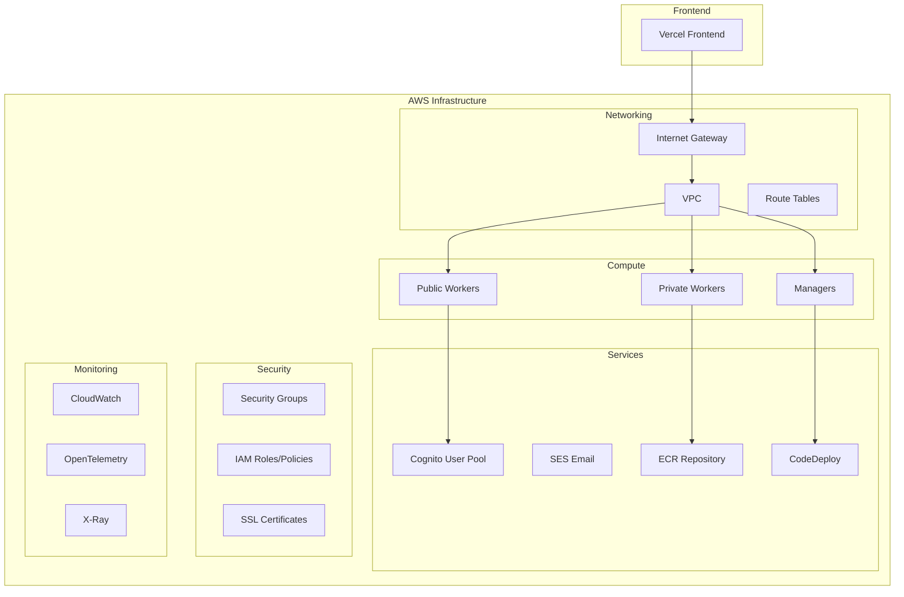

# 🏗️ Terraform Infrastructure Documentation

## 📋 Table of Contents

- [Overview](#overview)
- [Architecture](#architecture)
- [Infrastructure Components](#infrastructure-components)
- [Getting Started](#getting-started)
- [CI/CD Pipeline](#cicd-pipeline)
- [Module Documentation](#module-documentation)
- [Security & IAM](#security--iam)
- [Monitoring & Observability](#monitoring--observability)
- [Deployment](#deployment)
- [Troubleshooting](#troubleshooting)

---

## 🎯 Overview

This Terraform configuration provisions a complete production-ready infrastructure for a microservices-based authentication system. The infrastructure includes:

- **Docker Swarm Cluster** for container orchestration
- **AWS Cognito** for user authentication and management
- **SSL Certificate Management** with automated renewal
- **GitHub Actions CI/CD** with OIDC authentication
- **Vercel Frontend** deployment
- **Monitoring & Observability** with OpenTelemetry and CloudWatch
- **CodeDeploy** for automated microservice deployments

---

## 🏛️ Architecture



---

## 🧩 Infrastructure Components

### Core Infrastructure (`main.tf`)

| Component | Purpose | Resources |
|-----------|---------|-----------|
| **VPC & Networking** | Isolated network environment | VPC, Subnets, Route Tables, Internet Gateway |
| **EC2 Instances** | Docker Swarm cluster nodes | Public Workers, Private Workers, Managers |
| **Security Groups** | Network access control | HTTP/HTTPS, Docker Swarm, SSH access |
| **IAM Roles** | Instance permissions | SSM, CloudWatch, ECR, CodeDeploy access |
| **ECR Repository** | Container image storage | Microservices repository with lifecycle policies |

### Authentication & User Management (`cognito.tf`)

| Component | Purpose | Features |
|-----------|---------|----------|
| **Cognito User Pool** | User authentication | Email/password, social logins (Google/Apple) |
| **SES Configuration** | Email delivery | Domain verification, DKIM setup |
| **OAuth Providers** | Social authentication | Google, Apple integration |
| **Password Policies** | Security compliance | Minimum length, complexity requirements |

### SSL Certificate Management (`certificates.tf`)

| Component | Purpose | Features |
|-----------|---------|----------|
| **Certificate Storage** | S3 bucket for SSL certs | Encrypted storage with lifecycle policies |
| **Certbot Integration** | Automated renewal | DNS challenge validation |
| **Route53 Integration** | DNS management | Automated DNS record creation |
| **EBS Volume** | Persistent storage | Certificate data persistence |

### Deployment Automation (`codedeploy.tf`)

| Component | Purpose | Services |
|-----------|---------|----------|
| **CodeDeploy Apps** | Deployment orchestration | Authentication, Envoy, OTEL Collector |
| **Deployment Groups** | Target instance groups | Manager/private tier instances |
| **IAM Roles** | Deployment permissions | Service and EC2 instance roles |
| **S3 Bucket** | Deployment artifacts | Application bundles and scripts |

### DNS Management (`route53.tf`)

| Component | Purpose | Records |
|-----------|---------|---------|
| **Domain Records** | Primary domain routing | A, AAAA records for main domain |
| **Subdomain Records** | Service routing | A, AAAA records for subdomains |
| **Email Records** | Email authentication | SPF, DKIM records |
| **CNAME Records** | Alias management | www subdomain aliasing |

### CI/CD Integration

| Component | Purpose | Features |
|-----------|---------|----------|
| **GitHub Actions OIDC** | Secure authentication | No long-term credentials |
| **Vercel Integration** | Frontend deployment | Automatic deployments |
| **Environment Management** | Staging/Production | Separate environments |

### Monitoring & Observability (`otel-cloudwatch.tf`)

| Component | Purpose | Capabilities |
|-----------|---------|-------------|
| **OpenTelemetry** | Telemetry collection | Metrics, logs, traces |
| **CloudWatch** | Centralized monitoring | Log aggregation, metrics |
| **X-Ray** | Distributed tracing | Request tracing, performance analysis |

---

## 🚀 Getting Started

### Prerequisites

1. **AWS CLI** configured with appropriate permissions
2. **Terraform** >= 1.5.0 installed
3. **GitHub CLI** for repository management
4. **Domain name** with Route53 hosted zone

### Initial Setup

1. **Configure AWS Credentials**
   ```bash
   aws configure sso --profile infra-setup
   aws sso login --profile infra-setup
   ```

2. **Set Required Variables**
   ```bash
   export TF_VAR_region="us-west-1"
   export TF_VAR_app_name="your-app-name"
   export TF_VAR_environment="staging"
   export TF_VAR_domain_name="yourdomain.com"
   export TF_VAR_route53_hosted_zone_id="Z1234567890"
   ```

3. **Initialize Terraform**
   ```bash
   terraform init -backend-config="bucket=your-terraform-state-bucket"
   ```

4. **Plan and Apply**
   ```bash
   terraform plan
   terraform apply
   ```

---

## 🔄 CI/CD Pipeline

### GitHub Actions Setup

The infrastructure includes automated CI/CD using GitHub Actions with OIDC authentication:

#### Setup Scripts

| Script | Purpose | Location |
|--------|---------|----------|
| `setup-github-actions-oidc.sh` | Create OIDC resources | `Scripts/deployment/terraform/` |
| `remove-github-actions-oidc.sh` | Cleanup OIDC resources | `Scripts/deployment/terraform/` |

#### Automated Resources

- **OIDC Identity Provider** for GitHub Actions
- **S3 State Bucket** for Terraform state
- **IAM Roles & Policies** for secure access
- **GitHub Secrets & Variables** for configuration
- **Environment Protection** for staging/production

#### Workflow Triggers

- **Automatic**: PRs to `main` trigger Terraform plan
- **Manual**: Deploy/destroy via GitHub Actions UI
- **Environment Protection**: Separate staging/production environments

### Vercel Frontend Deployment

The infrastructure automatically configures Vercel for frontend deployment:

- **Automatic Deployments** from GitHub repository
- **Environment Variables** for API endpoints
- **Custom Domain** configuration
- **Preview Deployments** for pull requests

---

## 📚 Module Documentation

### Core Module (`main.tf`)

**Purpose**: Core infrastructure provisioning including VPC, EC2 instances, and basic networking.

**Key Variables**:
```hcl
variable "app_name" {
  description = "Application name used as resource prefix"
  type        = string
}

variable "environment" {
  description = "Environment name (staging/production)"
  type        = string
}

variable "region" {
  description = "AWS region for all resources"
  type        = string
}
```

**Key Resources**:
- VPC with public/private subnets
- EC2 instances for Docker Swarm cluster
- Security groups for network access
- IAM roles for instance permissions

### Authentication Module (`cognito.tf`)

**Purpose**: User authentication and management with social login support.

**Key Features**:
- Email/password authentication
- Google and Apple OAuth integration
- SES email configuration
- Password policies and account recovery

**Configuration Example**:
```hcl
variable "idps" {
  description = "Social/OIDC Identity Providers"
  type = map(object({
    client_id     = string
    client_secret = string
    scopes        = string
  }))
  default = {
    google = {
      client_id     = "your-google-client-id"
      client_secret = "your-google-client-secret"
      scopes        = "openid email profile"
    }
  }
}
```

### Certificate Management (`certificates.tf`)

**Purpose**: Automated SSL certificate management with Let's Encrypt.

**Key Features**:
- Automated certificate renewal
- DNS challenge validation
- S3 storage for certificates
- Route53 integration

**Security Features**:
- Encrypted certificate storage
- IAM policies for secure access
- Automated renewal triggers

### Deployment Automation (`codedeploy.tf`)

**Purpose**: Automated deployment of microservices to Docker Swarm cluster.

**Supported Services**:
- Authentication microservice
- Envoy proxy
- OpenTelemetry collector

**Deployment Strategy**:
- One-at-a-time deployments
- Health check integration
- Rollback capabilities

### DNS Management (`route53.tf`)

**Purpose**: Centralized DNS management for all domains and subdomains.

**Features**:
- Automatic A/AAAA record creation
- Subdomain management
- Email authentication records
- IPv6 support

### Monitoring (`otel-cloudwatch.tf`)

**Purpose**: Comprehensive monitoring and observability.

**Components**:
- OpenTelemetry collector configuration
- CloudWatch log aggregation
- X-Ray distributed tracing
- Custom metrics collection

---

## 🔐 Security & IAM

### IAM Roles and Policies

| Role | Purpose | Attached Policies |
|------|---------|-------------------|
| `public` | Public worker instances | SSM, CloudWatch, ECR, CodeDeploy |
| `private` | Private worker instances | SSM, CloudWatch, ECR |
| `manager` | Manager instances | SSM, CloudWatch, ECR, CodeDeploy |
| `codedeploy-service` | CodeDeploy service | AWS managed policy |
| `github-actions-certbot` | Certificate renewal | ECR, S3, STS access |

### Security Groups

| Group | Purpose | Allowed Traffic |
|-------|---------|-----------------|
| `instance` | EC2 instances | HTTP/HTTPS, Docker Swarm, SSH |
| **HTTP** | Web traffic | Port 80 (HTTP) |
| **HTTPS** | Secure web traffic | Port 443 (HTTPS) |
| **Docker Swarm** | Cluster communication | Ports 2377, 7946, 4789 |

### Network Security

- **VPC Isolation**: Private subnets for sensitive workloads
- **Security Groups**: Least-privilege access control
- **IAM Roles**: Instance-specific permissions
- **Encryption**: TLS for all external communications

---

## 📊 Monitoring & Observability

### CloudWatch Integration

**Log Groups**:
- `/aws/ec2/{app-name}-manager`
- `/aws/ec2/{app-name}-worker`
- `/aws/ec2/{app-name}-certificate-manager`

**Metrics**:
- EC2 instance metrics
- Application custom metrics
- Certificate renewal status

### OpenTelemetry Configuration

**Collectors**:
- Metrics collection from applications
- Log aggregation
- Distributed tracing

**Exporters**:
- CloudWatch for logs and metrics
- X-Ray for distributed tracing

### Alerting

**Default Alerts**:
- Certificate expiration warnings
- Instance health checks
- Deployment failures
- High resource utilization

---

## 🚀 Deployment

### Environment Management

| Environment | Purpose | Auto-deploy |
|-------------|---------|-------------|
| `staging` | Pre-production testing | Yes (on PR merge) |
| `production` | Live production | Manual approval required |

### Deployment Process

1. **Code Changes** → GitHub repository
2. **Automated Testing** → GitHub Actions
3. **Terraform Plan** → Infrastructure validation
4. **Manual Approval** → Production deployment
5. **Health Checks** → Deployment verification

### Rollback Strategy

- **Infrastructure**: Terraform state rollback
- **Applications**: CodeDeploy rollback
- **Certificates**: Manual renewal trigger
- **DNS**: Route53 health check failover

---

## 🔧 Troubleshooting

### Common Issues

#### Certificate Renewal Failures

**Symptoms**: SSL certificate expiration warnings
**Solutions**:
1. Check certbot logs: `/var/log/certificate-manager/`
2. Verify DNS records in Route53
3. Check IAM permissions for certbot role
4. Trigger manual renewal: `sudo systemctl restart certificate-manager`

#### Docker Swarm Issues

**Symptoms**: Container deployment failures
**Solutions**:
1. Check swarm status: `docker node ls`
2. Verify network connectivity: `docker network ls`
3. Check manager logs: `docker service logs`
4. Rejoin worker nodes if needed

#### GitHub Actions Failures

**Symptoms**: OIDC authentication errors
**Solutions**:
1. Verify OIDC provider configuration
2. Check IAM role trust relationships
3. Validate GitHub repository settings
4. Review environment protection rules

### Debugging Commands

```bash
# Check Terraform state
terraform show

# View CloudWatch logs
aws logs tail /aws/ec2/your-app-name-manager

# SSH to instances (via SSM)
aws ssm start-session --target i-1234567890abcdef0

# Check certificate status
aws ssm send-command --instance-ids i-1234567890abcdef0 --document-name "AWS-RunShellScript" --parameters 'commands=["sudo systemctl status certificate-manager"]'
```

### Support Resources

- **Terraform Documentation**: [hashicorp.com/terraform/docs](https://www.terraform.io/docs)
- **AWS Documentation**: [docs.aws.amazon.com](https://docs.aws.amazon.com)
- **GitHub Actions**: [docs.github.com/en/actions](https://docs.github.com/en/actions)
- **Docker Swarm**: [docs.docker.com/engine/swarm](https://docs.docker.com/engine/swarm)

---

## 📝 Contributing

### Development Workflow

1. **Fork** the repository
2. **Create** a feature branch
3. **Make** changes with proper documentation
4. **Test** changes in staging environment
5. **Submit** pull request with detailed description

### Code Standards

- **Terraform**: Use consistent formatting (`terraform fmt`)
- **Documentation**: Update README for significant changes
- **Variables**: Use descriptive names and validation
- **Security**: Follow least-privilege principle

### Testing

- **Plan Testing**: `terraform plan` for all environments
- **Apply Testing**: Staging environment validation
- **Integration Testing**: End-to-end deployment verification
- **Security Testing**: IAM policy validation

---

*Last updated: $(date)*
