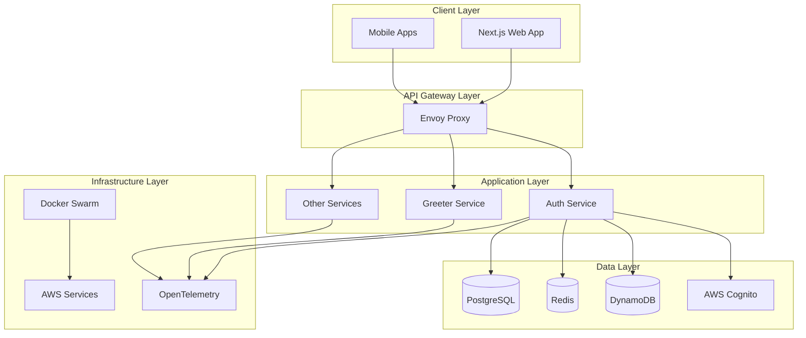
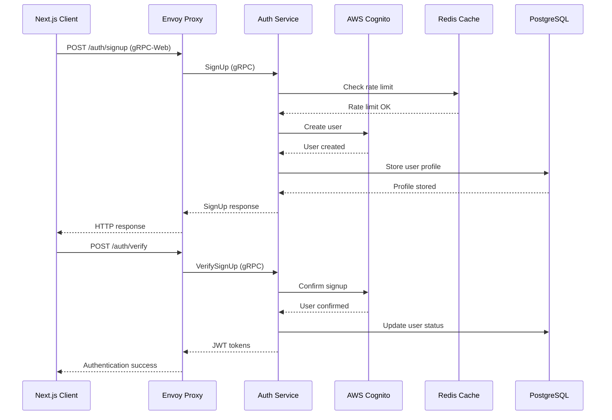
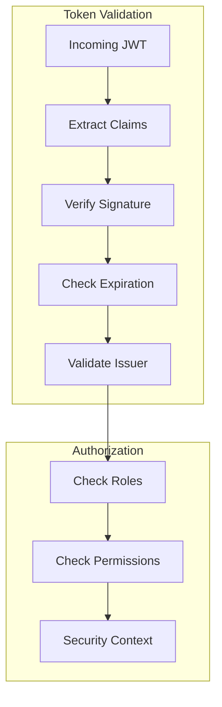
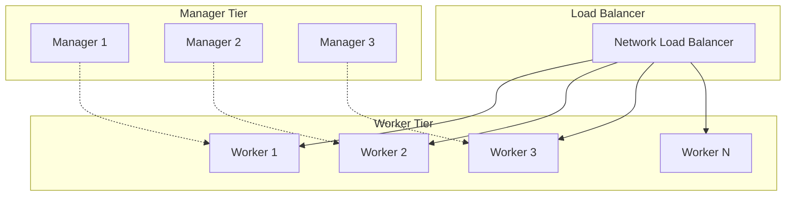
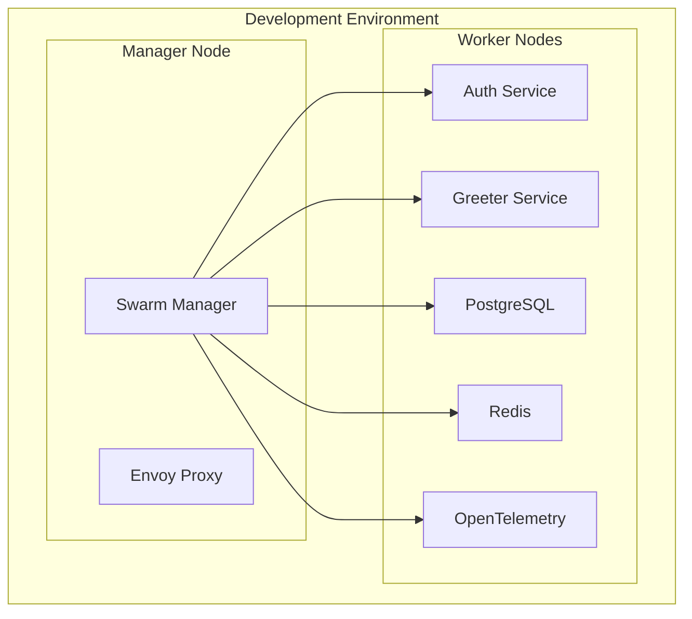
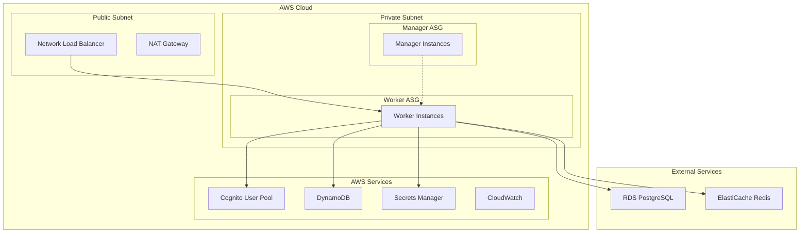
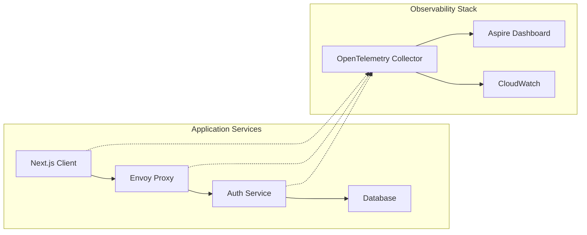

# Architecture Overview

## System Overview

The authentication system is a modern, production-ready microservices platform built with .NET gRPC services, Next.js frontend, and enterprise-grade infrastructure. The system demonstrates secure user authentication patterns using cloud-native technologies and follows distributed system best practices.

### Key Architectural Principles

- **Microservices Architecture**: Loosely coupled services with clear boundaries
- **API-First Design**: gRPC services with protocol buffer contracts
- **Security by Design**: JWT-based authentication with comprehensive validation
- **Observability**: Built-in monitoring, tracing, and logging
- **Scalability**: Horizontal scaling with Docker Swarm and AWS Auto Scaling
- **Infrastructure as Code**: Terraform-managed AWS infrastructure

## High-Level Architecture



## Component Architecture

### Frontend Layer

#### Next.js Application
- **Technology**: Next.js 15.3+ with App Router, React 19, TypeScript
- **Communication**: gRPC-Web for backend communication
- **Authentication**: OIDC Client with JWT token management
- **State Management**: React Context for authentication state
- **Styling**: Tailwind CSS with Radix UI components

**Key Components**:
- Authentication flows (signup, signin, verification)
- Session management and token refresh
- Error handling and user feedback
- Responsive design with dark mode support

### API Gateway Layer

#### Envoy Proxy
- **Purpose**: API Gateway, load balancer, and protocol translation
- **Features**: 
  - gRPC-Web to gRPC protocol translation
  - Rate limiting and CORS handling
  - Request routing and load balancing
  - TLS termination and security headers

**Routing Configuration**:
```yaml
# Route /auth/* to Auth Service
- match:
    prefix: "/auth/"
  route:
    cluster: auth_cluster
    
# Route /greet/* to Greeter Service  
- match:
    prefix: "/greet/"
  route:
    cluster: greeter_cluster
```

### Application Layer

#### Auth Service (.NET gRPC)
- **Architecture**: Clean Architecture with Domain-Driven Design
- **Layers**:
  - `Auth.Grpc`: API layer with gRPC services and validators
  - `Auth.Core`: Domain logic and business rules
  - `Auth.Infrastructure`: External integrations (AWS, databases)

**Core Services**:
- `SignUpService`: User registration and verification
- `AuthorizationService`: Authentication and token management
- `InternalAuthorizationService`: Internal service authentication

#### Shared Libraries
- **Api**: CORS, rate limiting, validation, secrets management
- **Authentication**: JWT validation and session management
- **Infrastructure**: AWS credentials and configuration
- **Logging**: Structured logging with OpenTelemetry
- **Exceptions**: Common error codes and gRPC error handling

### Data Layer

#### PostgreSQL
- **Purpose**: Primary relational database
- **Usage**: User profiles, application data, audit logs
- **Features**: ACID compliance, complex queries, data integrity

#### Redis
- **Purpose**: Caching and session storage
- **Usage**: Rate limiting, session data, temporary storage
- **Features**: High performance, pub/sub, data structures

#### DynamoDB
- **Purpose**: NoSQL storage for session tokens
- **Usage**: Refresh token storage, high-scale session data
- **Features**: Serverless, auto-scaling, global tables

#### AWS Cognito
- **Purpose**: Identity provider and user management
- **Usage**: User authentication, password policies, MFA
- **Features**: OAuth/OIDC, social login, user pools

### Infrastructure Layer

#### Development Environment (Docker Swarm)
- **Orchestration**: Docker Swarm for local development
- **Services**: Containerized microservices with service discovery
- **Networking**: Overlay networks for service communication
- **Storage**: Named volumes for data persistence

#### Production Environment (AWS)
- **Compute**: EC2 instances with Auto Scaling Groups
- **Load Balancing**: Network Load Balancer with TLS termination
- **DNS**: Route53 for domain management
- **Deployment**: CodeDeploy for automated deployments
- **Monitoring**: CloudWatch for logs and metrics

## Data Flow Architecture

### Authentication Flow



### Request Processing Flow

```mermaid
graph LR
    subgraph "Client Request"
        REQ[HTTP Request]
    end
    
    subgraph "API Gateway Processing"
        CORS[CORS Check]
        RATE[Rate Limiting]
        ROUTE[Route Matching]
        PROTO[Protocol Translation]
    end
    
    subgraph "Service Processing"
        VALID[Request Validation]
        AUTH[Authentication]
        BIZ[Business Logic]
        DATA[Data Access]
    end
    
    subgraph "Response Processing"
        RESP[Response Generation]
        TRACE[Tracing/Logging]
        CACHE[Cache Update]
    end
    
    REQ --> CORS
    CORS --> RATE
    RATE --> ROUTE
    ROUTE --> PROTO
    PROTO --> VALID
    VALID --> AUTH
    AUTH --> BIZ
    BIZ --> DATA
    DATA --> RESP
    RESP --> TRACE
    TRACE --> CACHE
```



## Security Architecture

### Authentication Model

#### JWT Token Strategy
- **Access Tokens**: Short-lived (15 minutes) for API access
- **Refresh Tokens**: Long-lived (7 days) for token renewal
- **ID Tokens**: User identity information from Cognito

#### Token Validation Flow


### Security Layers

#### Network Security
- **TLS Encryption**: End-to-end encryption with TLS 1.3
- **CORS Policy**: Strict origin validation
- **Rate Limiting**: Redis-based sliding window algorithm
- **DDoS Protection**: AWS Shield and CloudFront

#### Application Security
- **Input Validation**: FluentValidation with custom rules
- **SQL Injection Prevention**: Parameterized queries with EF Core
- **XSS Protection**: Content Security Policy headers
- **CSRF Protection**: SameSite cookies and CSRF tokens

#### Infrastructure Security
- **VPC Isolation**: Private subnets for application tier
- **Security Groups**: Least privilege network access
- **IAM Roles**: Fine-grained AWS permissions
- **Secrets Management**: AWS Secrets Manager integration

## Scalability Patterns

### Horizontal Scaling

#### Auto Scaling Groups


#### Scaling Triggers
- **CPU Utilization**: Scale up at 80%, scale down at 10%
- **Memory Usage**: Monitor memory pressure
- **Request Rate**: Scale based on incoming requests
- **Custom Metrics**: Application-specific scaling metrics

### Database Scaling

#### Read Replicas
- PostgreSQL read replicas for query distribution
- Redis clustering for cache distribution
- DynamoDB auto-scaling for session storage

#### Connection Pooling
- Connection pooling in .NET services
- Redis connection multiplexing
- Database connection limits and monitoring

## Deployment Architecture

### Development Deployment

#### Docker Swarm Cluster


### Production Deployment

#### AWS Infrastructure


#### Deployment Pipeline
1. **Code Commit**: Developer pushes to GitHub
2. **CI/CD Pipeline**: GitHub Actions builds and tests
3. **Container Registry**: Push images to ECR
4. **Infrastructure**: Terraform applies changes
5. **Application Deployment**: CodeDeploy updates services
6. **Health Checks**: Validate deployment success
7. **Monitoring**: CloudWatch alerts on issues

## Observability Architecture

### Distributed Tracing

#### OpenTelemetry Integration


### Monitoring Strategy

#### Metrics Collection
- **Application Metrics**: Request rates, response times, error rates
- **Infrastructure Metrics**: CPU, memory, disk, network usage
- **Business Metrics**: User registrations, authentication success rates
- **Security Metrics**: Failed login attempts, rate limit violations

#### Logging Strategy
- **Structured Logging**: JSON format with correlation IDs
- **Log Levels**: Debug, Info, Warning, Error, Critical
- **Log Aggregation**: CloudWatch Logs with retention policies
- **Log Analysis**: CloudWatch Insights for querying

## Feature Integration Patterns

### Cross-Cutting Concerns

#### Authentication Integration
Every service integrates authentication through:
1. **JWT Validation**: Shared authentication library
2. **Authorization Context**: User identity propagation
3. **Session Management**: Consistent token handling
4. **Security Headers**: Standard security response headers

#### Error Handling Integration
Consistent error handling across all layers:
1. **gRPC Status Codes**: Standardized error responses
2. **Error Propagation**: Structured error information
3. **Client Error Handling**: User-friendly error messages
4. **Logging Integration**: Correlated error tracking

#### Rate Limiting Integration
Comprehensive rate limiting strategy:
1. **Gateway Level**: Envoy proxy rate limiting
2. **Service Level**: Redis-based rate limiting
3. **User Level**: Per-user rate limits
4. **Global Level**: System-wide protection

### Service Communication Patterns

#### Synchronous Communication
- **gRPC Services**: Type-safe, high-performance RPC
- **Protocol Buffers**: Versioned API contracts
- **Service Discovery**: Docker Swarm service names
- **Load Balancing**: Round-robin with health checks

#### Asynchronous Communication
- **Event Sourcing**: Domain events for state changes
- **Message Queues**: Redis pub/sub for notifications
- **Background Jobs**: Scheduled tasks and cleanup
- **Webhook Integration**: External system notifications

## Performance Characteristics

### Latency Targets
- **Authentication**: < 100ms for token validation
- **User Registration**: < 500ms for complete flow
- **API Responses**: < 200ms for typical requests
- **Database Queries**: < 50ms for simple queries

### Throughput Targets
- **Concurrent Users**: 10,000+ simultaneous users
- **Requests per Second**: 5,000+ RPS sustained
- **Authentication Rate**: 1,000+ auth/sec
- **Database Connections**: 100+ concurrent connections

### Scalability Limits
- **Horizontal Scaling**: Auto-scale to 20+ instances
- **Database Scaling**: Read replicas for query distribution
- **Cache Scaling**: Redis clustering for high availability
- **Storage Scaling**: Unlimited with cloud storage

## Disaster Recovery

### Backup Strategy
- **Database Backups**: Automated daily backups with point-in-time recovery
- **Configuration Backups**: Infrastructure as Code in version control
- **Secret Backups**: Encrypted backup of secrets and certificates
- **Application Backups**: Container images in multiple registries

### Recovery Procedures
- **RTO (Recovery Time Objective)**: < 4 hours for full recovery
- **RPO (Recovery Point Objective)**: < 1 hour data loss maximum
- **Failover Strategy**: Multi-AZ deployment with automatic failover
- **Testing Schedule**: Monthly disaster recovery drills

This architecture overview provides a comprehensive understanding of how all system components work together to deliver a secure, scalable, and maintainable authentication platform.