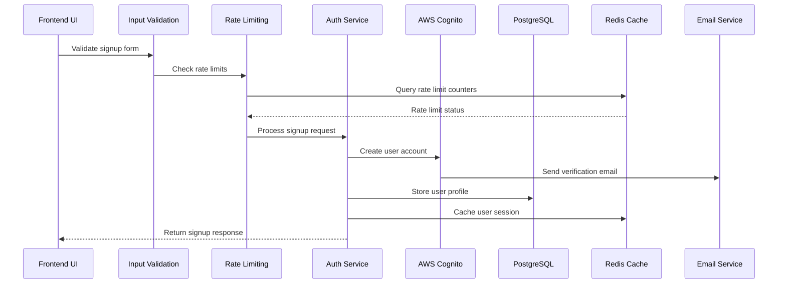
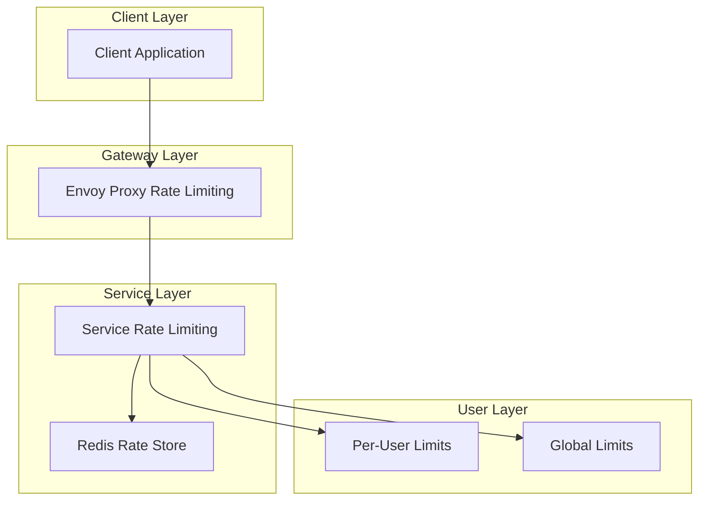
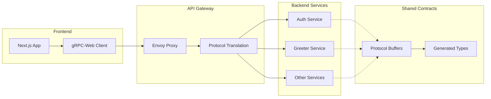
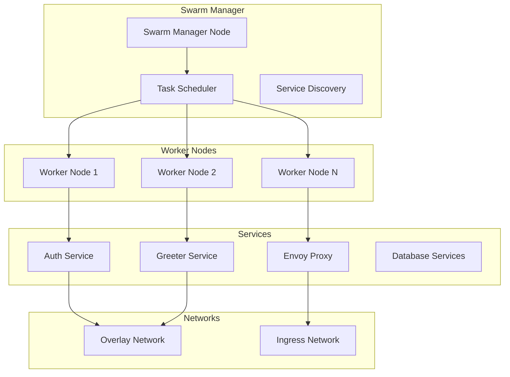
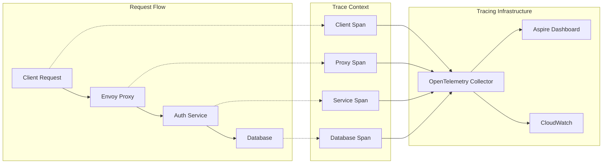
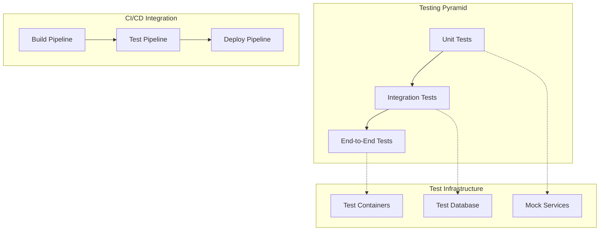
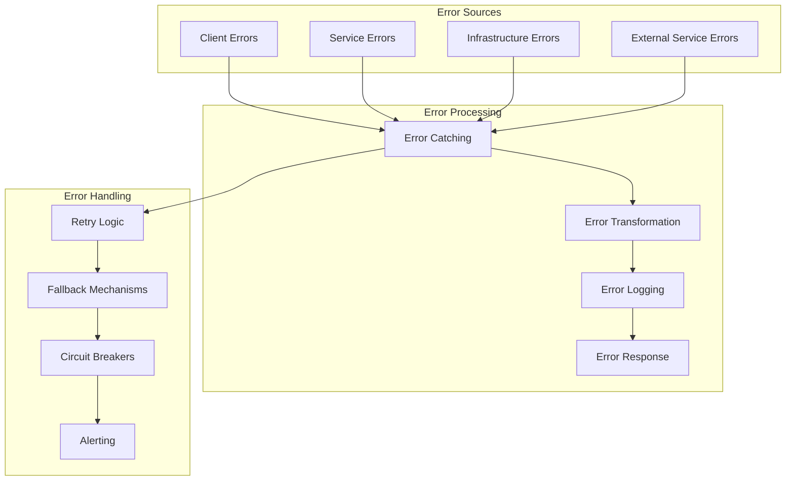
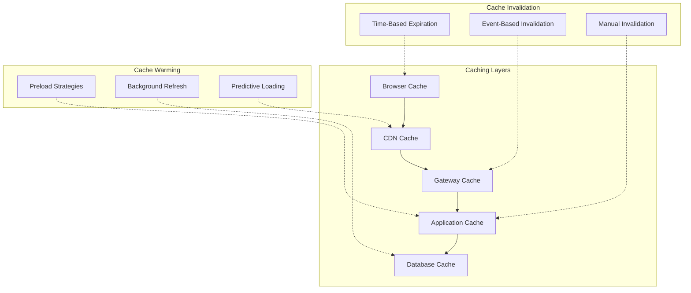
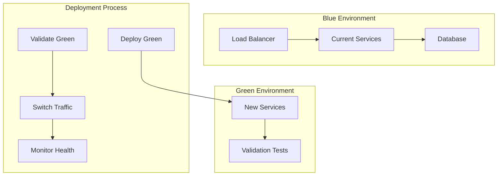

# Feature Integration Guide

## Overview

This guide explains how different features in the authentication system work together to provide a cohesive user experience. Understanding these integrations is crucial for developers working on feature enhancements or troubleshooting issues.

## Authentication Feature Integration

### User Registration Flow Integration

The user registration process demonstrates how multiple features work together:

#### Feature Dependencies
1. **Input Validation** → **Rate Limiting**: Validated requests are rate-limited
2. **Rate Limiting** → **Authentication**: Rate-limited requests proceed to auth
3. **Authentication** → **Database**: User data is persisted
4. **Authentication** → **Email Service**: Verification emails are sent
5. **Authentication** → **Session Management**: User sessions are created

### Authentication Token Flow Integration

JWT token management integrates multiple security features:

```mermaid
graph TB
    subgraph "Token Generation"
        LOGIN[User Login]
        VALIDATE[Credential Validation]
        GENERATE[Token Generation]
        STORE[Session Storage]
    end
    
    subgraph "Token Validation"
        REQUEST[API Request]
        EXTRACT[Token Extraction]
        VERIFY[Signature Verification]
        CHECK[Expiration Check]
        AUTHORIZE[Authorization Check]
    end
    
    subgraph "Token Refresh"
        REFRESH[Refresh Request]
        VALIDATE_RT[Validate Refresh Token]
        GENERATE_NEW[Generate New Tokens]
        UPDATE[Update Session]
    end
    
    LOGIN --> VALIDATE
    VALIDATE --> GENERATE
    GENERATE --> STORE
    
    REQUEST --> EXTRACT
    EXTRACT --> VERIFY
    VERIFY --> CHECK
    CHECK --> AUTHORIZE
    
    REFRESH --> VALIDATE_RT
    VALIDATE_RT --> GENERATE_NEW
    GENERATE_NEW --> UPDATE
```

## Security Feature Integration

### Multi-Layer Security Integration

Security features work together to provide defense in depth:

#### Layer 1: Network Security
- **CORS Configuration**: Validates request origins
- **TLS Termination**: Encrypts data in transit
- **Rate Limiting**: Prevents abuse at the gateway level

#### Layer 2: Application Security
- **Input Validation**: Sanitizes and validates all inputs
- **JWT Validation**: Verifies token authenticity and expiration
- **Authorization**: Checks user permissions and roles

#### Layer 3: Data Security
- **SQL Injection Prevention**: Parameterized queries
- **Data Encryption**: Sensitive data encryption at rest
- **Audit Logging**: Comprehensive security event logging

### Rate Limiting Integration Points

Rate limiting is integrated at multiple levels:

#### Integration Flow
1. **Envoy Proxy**: First-level rate limiting based on IP/route
2. **Service Level**: Business logic rate limiting with Redis
3. **User Level**: Per-user rate limits based on authentication
4. **Global Level**: System-wide protection against overload

## API and Communication Integration

### gRPC Service Integration

Services communicate through well-defined gRPC contracts:

### Protocol Buffer Integration

Shared protocol definitions ensure type safety across services:

#### Code Generation Integration
1. **Proto Definitions**: Centralized service contracts
2. **Client Generation**: TypeScript types for frontend
3. **Server Generation**: C# classes for backend
4. **Validation Integration**: Shared validation rules

#### Version Management
- **Backward Compatibility**: Proto evolution strategies
- **Breaking Changes**: Coordinated service updates
- **Testing Integration**: Contract testing across services

## Infrastructure Feature Integration

### Container Orchestration Integration

Docker Swarm orchestrates all application components:

### Database Integration Patterns

Multiple databases serve different purposes:

#### PostgreSQL Integration
- **Primary Database**: User profiles, application data
- **ACID Compliance**: Transactional consistency
- **Connection Pooling**: Efficient connection management
- **Migration Integration**: Schema version management

#### Redis Integration
- **Session Storage**: Fast session data access
- **Rate Limiting**: Sliding window counters
- **Caching Layer**: Frequently accessed data
- **Pub/Sub**: Real-time notifications

#### DynamoDB Integration
- **Refresh Tokens**: Scalable token storage
- **Session Metadata**: Distributed session information
- **Auto Scaling**: Demand-based capacity scaling
- **Global Tables**: Multi-region replication

## Monitoring and Observability Integration

### Distributed Tracing Integration

OpenTelemetry provides end-to-end request tracing:

### Logging Integration

Structured logging provides comprehensive system visibility:

#### Log Correlation
- **Correlation IDs**: Track requests across services
- **User Context**: Associate logs with user actions
- **Session Context**: Group logs by user session
- **Request Context**: Trace individual request flows

#### Log Aggregation
- **Service Logs**: Application-specific logging
- **Infrastructure Logs**: System and container logs
- **Security Logs**: Authentication and authorization events
- **Performance Logs**: Metrics and performance data

## Development and Testing Integration

### Testing Strategy Integration

Different testing levels work together for comprehensive coverage:

### Development Workflow Integration

Development tools work together for efficient development:

#### Local Development
1. **Docker Compose**: Local service orchestration
2. **Hot Reload**: Automatic code reloading
3. **Debug Integration**: Integrated debugging tools
4. **Database Seeding**: Test data management

#### Code Generation Integration
1. **Proto Generation**: gRPC client/server code
2. **Type Generation**: TypeScript type definitions
3. **Error Code Generation**: Consistent error handling
4. **Documentation Generation**: API documentation

## Error Handling Integration

### Cross-Service Error Handling

Errors are handled consistently across all services:

### Error Propagation Strategy

Errors are propagated with context preservation:

#### gRPC Error Handling
- **Status Codes**: Standard gRPC status codes
- **Error Details**: Rich error information
- **Metadata**: Additional error context
- **Retry Policies**: Automatic retry strategies

#### Client Error Handling
- **User-Friendly Messages**: Translated error messages
- **Error Recovery**: Automatic recovery mechanisms
- **Error Reporting**: Optional error reporting
- **Fallback UI**: Graceful degradation

## Performance Integration

### Caching Strategy Integration

Multi-level caching improves performance:

### Connection Pooling Integration

Efficient resource utilization through connection pooling:

#### Database Connections
- **Connection Limits**: Maximum concurrent connections
- **Pool Sizing**: Optimal pool size configuration
- **Connection Validation**: Health check integration
- **Timeout Management**: Connection timeout handling

#### Redis Connections
- **Connection Multiplexing**: Shared connections
- **Pipeline Support**: Batch operations
- **Cluster Support**: Redis cluster integration
- **Failover Support**: Automatic failover handling

## Deployment Integration

### Blue-Green Deployment Integration

Zero-downtime deployments through coordinated updates:

### Configuration Management Integration

Centralized configuration management:

#### Environment-Specific Configuration
- **Development**: Local development settings
- **Testing**: Test environment configuration
- **Staging**: Pre-production settings
- **Production**: Production-optimized configuration

#### Secret Management Integration
- **AWS Secrets Manager**: Centralized secret storage
- **Environment Variables**: Runtime configuration
- **Configuration Validation**: Startup validation
- **Hot Reloading**: Dynamic configuration updates

## Troubleshooting Integration Points

### Common Integration Issues

#### Authentication Integration Issues
1. **Token Validation Failures**: JWT signature or expiration issues
2. **Session Synchronization**: Session state inconsistencies
3. **Rate Limiting Conflicts**: Multiple rate limiting layers
4. **CORS Configuration**: Cross-origin request failures

#### Service Communication Issues
1. **gRPC Connection Failures**: Network or service discovery issues
2. **Protocol Buffer Mismatches**: Version compatibility problems
3. **Load Balancing Issues**: Uneven traffic distribution
4. **Circuit Breaker Activation**: Service degradation handling

#### Database Integration Issues
1. **Connection Pool Exhaustion**: Too many concurrent connections
2. **Transaction Deadlocks**: Concurrent access conflicts
3. **Migration Failures**: Schema update problems
4. **Replication Lag**: Read replica synchronization delays

### Debugging Integration Flows

#### Request Tracing
1. **Correlation ID Tracking**: Follow requests across services
2. **Span Analysis**: Identify performance bottlenecks
3. **Error Correlation**: Link errors to specific requests
4. **Performance Analysis**: Identify slow components

#### Log Analysis
1. **Structured Log Queries**: Search across service logs
2. **Error Pattern Analysis**: Identify recurring issues
3. **Performance Metrics**: Monitor response times
4. **Security Event Analysis**: Track authentication events

This feature integration guide provides a comprehensive understanding of how different system components work together to deliver a cohesive and reliable authentication platform.